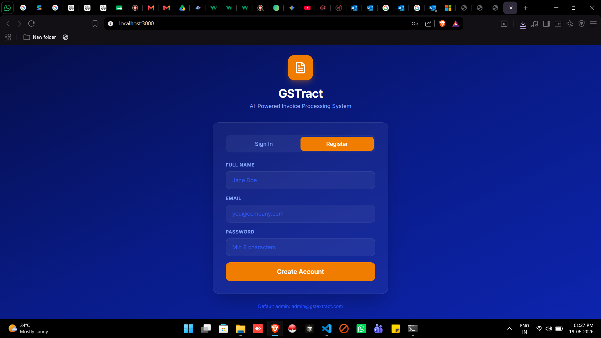
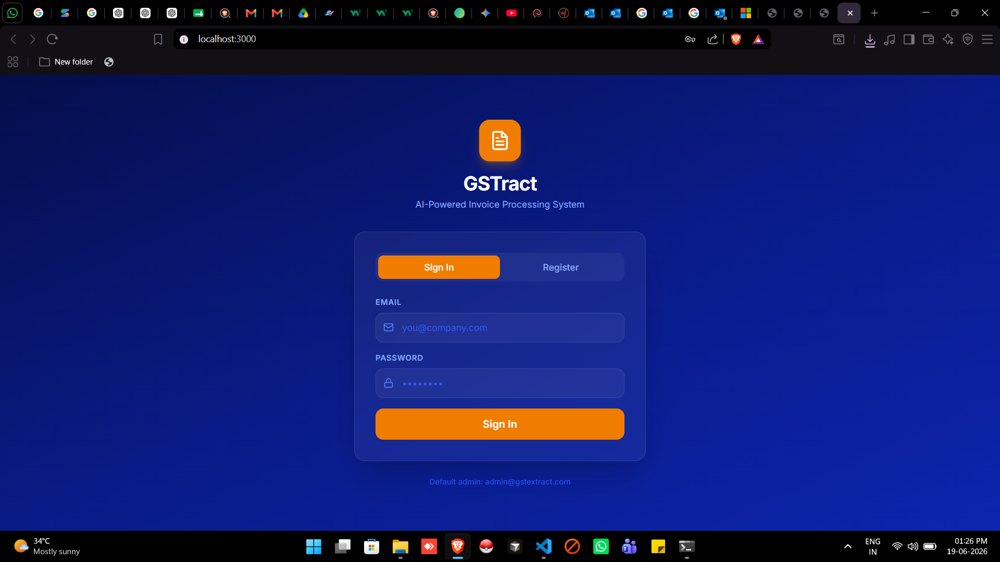
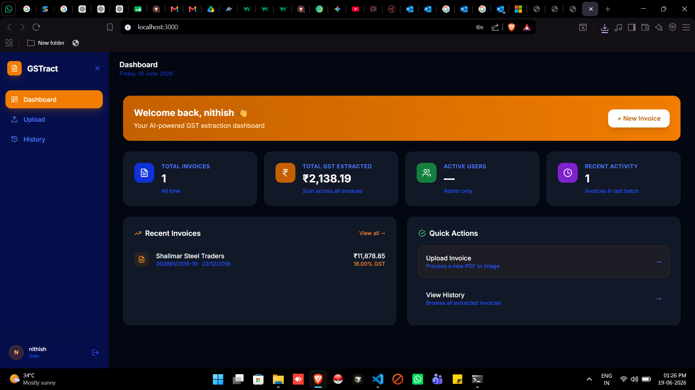
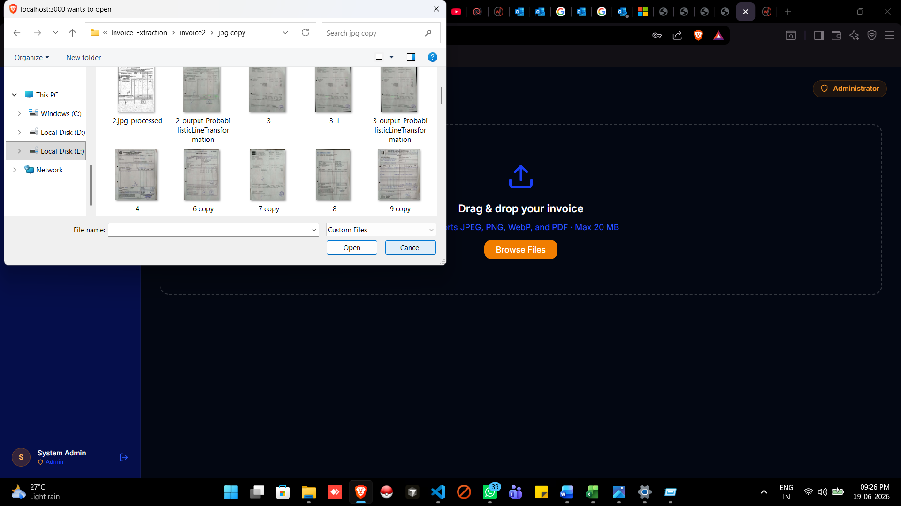
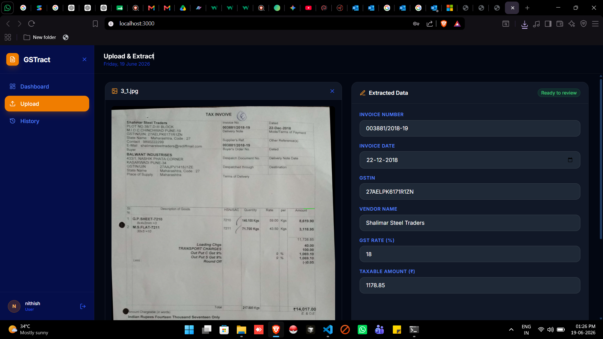
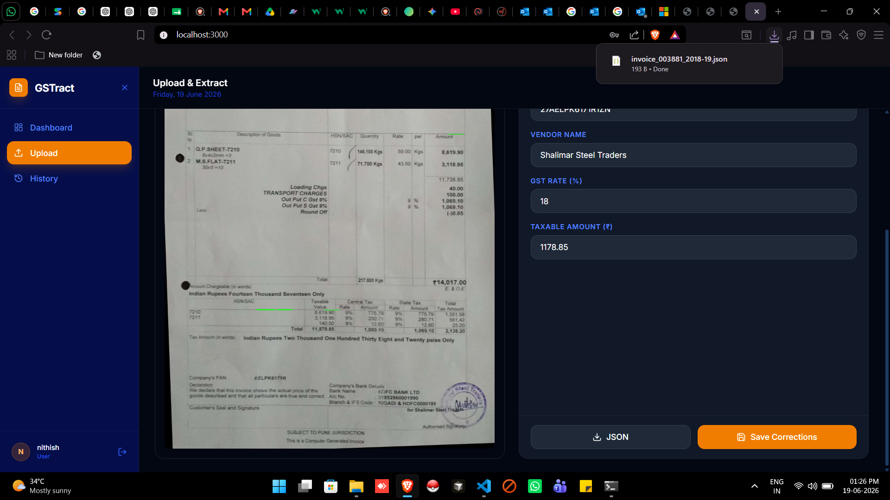
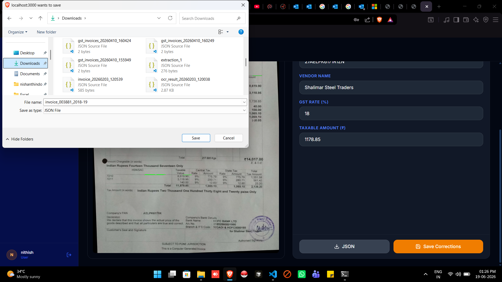
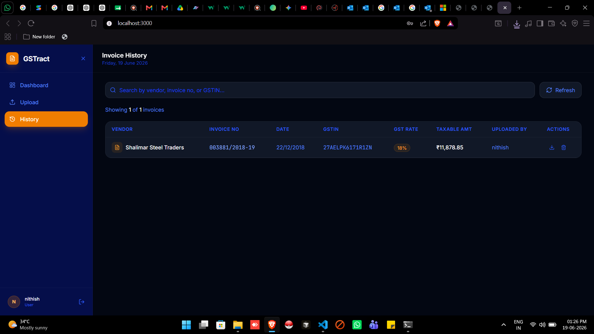
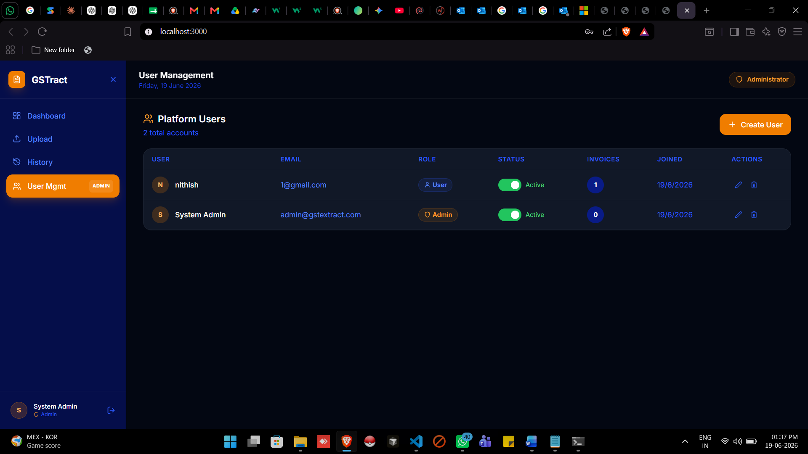

# GSTract — AI-Powered Invoice Processing & GST Data Extraction System

A full-stack, multi-user platform that uses **Google Gemini's native multimodal capabilities** to extract structured GST invoice data from PDFs and images — with zero OCR dependencies.

---
## 📸 Project Screenshots

### 📝 Registration Page



---

### 🔐 Sign In Page



---

### 🖼️ Dashboard 



---

### 📤 Upload Invoice



---

### 🤖 Invoice Data Extraction



---

### 📥 Download JSON (Example 1)



---

### 📥 Download JSON (Example 2)



---

### 📜 Invoice History



---

### 👨‍💼 Admin Dashboard



## 🏗️ Architecture Overview

```
invoice-gst-system/
├── backend/
│   ├── config/
│   │   └── db.js              # PostgreSQL connection pool
│   ├── db/
│   │   ├── init.sql           # Schema: users + invoices tables
│   │   └── seed.js            # Run once to initialize DB + admin user
│   ├── middleware/
│   │   └── auth.js            # JWT verify + role guard
│   ├── routes/
│   │   ├── auth.js            # POST /login, POST /register
│   │   ├── extract.js         # POST /extract — Gemini pipeline
│   │   ├── invoices.js        # GET/PUT/DELETE /invoices
│   │   └── admin.js           # CRUD /admin/users (admin-only)
│   ├── .env.example           # Copy to .env and fill values
│   ├── package.json
│   └── server.js              # Express app entry point
│
└── frontend/
    ├── public/
    │   └── index.html
    ├── src/
    │   ├── context/
    │   │   └── AuthContext.jsx  # Global user state + axios config
    │   ├── pages/
    │   │   ├── LoginPage.jsx    # Auth screen (login + register tabs)
    │   │   ├── Dashboard.jsx    # Stats + recent activity
    │   │   ├── UploadAndExtract.jsx  # Drag-drop + split-screen viewer
    │   │   ├── History.jsx      # Data grid + search + JSON download
    │   │   └── UserManagement.jsx   # Admin user CRUD panel
    │   ├── App.jsx              # Root with sidebar + page routing
    │   ├── index.js             # React entry point
    │   └── index.css            # Tailwind + Google Fonts
    ├── tailwind.config.js
    └── package.json
```

---

## 🔑 Tech Stack

| Layer      | Technology                         |
|------------|-------------------------------------|
| Frontend   | React 18, Tailwind CSS, Lucide, Axios |
| Backend    | Node.js, Express                    |
| Database   | PostgreSQL (native `pg` client)     |
| AI Engine  | Google Gemini 2.0 Flash via `@google/genai` |
| Auth       | JWT (jsonwebtoken) + bcrypt         |
| File Upload| Multer (in-memory storage)          |

---

## 🚀 Setup Instructions

### 1. Prerequisites
- Node.js v18+
- PostgreSQL 14+
- A Google Gemini API key ([get one here](https://makersuite.google.com/app/apikey))

### 2. Database Setup

```bash
# Create the database
psql -U postgres -c "CREATE DATABASE invoice_gst_db;"
```

### 3. Backend Setup

```bash
cd backend

# Install dependencies
npm install

# Configure environment
cp .env.example .env
# Edit .env and fill in:
#   DB_HOST, DB_PORT, DB_NAME, DB_USER, DB_PASSWORD
#   JWT_SECRET (any long random string)
#   GEMINI_API_KEY

# Initialize database schema and create admin user
node db/seed.js

# Start the server
npm run dev       # development (nodemon)
# or
npm start         # production
```

Server runs at **http://localhost:5000**

### 4. Frontend Setup

```bash
cd frontend

# Install dependencies
npm install

# Start the React dev server
npm start
```

App runs at **http://localhost:3000**

---

**Change this immediately in production.**

---

## 📡 API Reference

### Authentication
| Method | Endpoint | Description |
|--------|----------|-------------|
| POST | `/api/auth/login` | Login, get JWT |
| POST | `/api/auth/register` | Register new user |

### Invoice Extraction (requires JWT)
| Method | Endpoint | Description |
|--------|----------|-------------|
| POST | `/api/extract` | Upload file → Gemini extraction → save |

### Invoice Management (requires JWT)
| Method | Endpoint | Description |
|--------|----------|-------------|
| GET | `/api/invoices` | List invoices (with pagination + search) |
| GET | `/api/invoices/stats/dashboard` | Dashboard aggregates |
| GET | `/api/invoices/:id` | Single invoice + raw JSONB |
| PUT | `/api/invoices/:id` | Update after human correction |
| DELETE | `/api/invoices/:id` | Delete invoice + file |

### Admin (requires JWT + admin role)
| Method | Endpoint | Description |
|--------|----------|-------------|
| GET | `/api/admin/users` | All users + invoice counts |
| POST | `/api/admin/users` | Create new user |
| PUT | `/api/admin/users/:id` | Update name/role/status |
| DELETE | `/api/admin/users/:id` | Delete user |

---

## 🤖 Gemini Extraction Pipeline

The extraction is **100% OCR-free**. Files are sent directly to Gemini as `inlineData`:

```
File (PDF/Image)
       ↓
  Multer (memory)
       ↓
  Base64 encode
       ↓
  Gemini 2.0 Flash
  (inlineData + structured output schema)
       ↓
  Guaranteed JSON response:
  {
    invoice_no, invoice_date, gstin_no,
    vendor_name, gst_rate, taxable_amount
  }
       ↓
  Save to PostgreSQL (JSONB + normalized columns)
```

The `responseMimeType: 'application/json'` + `responseSchema` config enforces Gemini's structured output feature, eliminating JSON parsing failures.

---

## 🗂️ Database Schema

### `users`
```sql
id UUID, name, email (unique), password_hash,
role CHECK('user','admin'), status CHECK('active','suspended'), created_at
```

### `invoices`
```sql
id UUID, user_id FK→users, invoice_no, invoice_date DATE,
gstin_no VARCHAR(15), vendor_name, gst_rate NUMERIC(5,2),
taxable_amount NUMERIC(12,2), raw_extracted_json JSONB,
file_path TEXT, original_filename, created_at
```

---

## 🎨 Features at a Glance

- **Drag & drop upload** — JPEG, PNG, WebP, PDF (up to 20 MB)
- **Split-screen extraction view** — Document viewer + editable form side-by-side
- **Human-in-the-loop correction** — Edit any extracted field before saving
- **Download JSON** — Client-side trigger from the DB's raw JSONB column
- **Invoice history** — Paginated table, full-text search, per-row download + delete
- **Admin User Management** — Status toggles, role badges, invoice counters, modal-based CRUD
- **Role-based access** — Admin nav tab and endpoints guard with `requireRole('admin')`

---

## 📦 Production Checklist

- [ ] Change `JWT_SECRET` to a cryptographically random 64+ char string
- [ ] Change default admin password after first login
- [ ] Set `NODE_ENV=production`
- [ ] Move file storage to S3/GCS (replace local disk writes in `extract.js`)
- [ ] Add HTTPS / reverse proxy (nginx)
- [ ] Set `FRONTEND_URL` in backend `.env` to your actual domain
- [ ] Add rate limiting (`express-rate-limit`) to `/api/extract`
